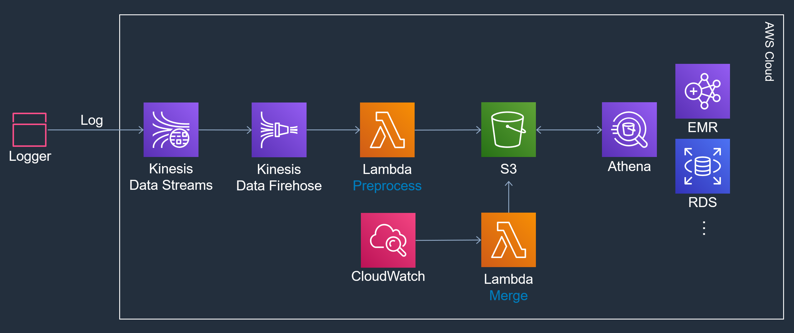

# Kinesis Logger

[Kinesis](https://aws.amazon.com/ko/kinesis) 를 이용한 로그 수집기

## 구조

## 요약

+ JSON
  + i. 로그는 JSON 형태로 가공한다
  + 데이터(Record, Row)의 단위는 줄바꿈(\n)으로 한다
+ [Logger](/src/KLoggerSuite/KLogger/)
  + C# 으로만 구현되어 있다
  + 백그라운드 스레드에서 로그를 묶어서 Kinesis 로 보낸다
    + 로그를 바로 보내는 것 보다 배치로 Kinesis 에 전송하는 것이 성능에 도움이 된다
    + [Batch API](https://docs.aws.amazon.com/ko_kr/kinesis/latest/APIReference/API_PutRecords.html) 를 사용한다
  + 로그가 일정 크기 이상이면 압축을 한다
    + 압축 기능을 사용하려면 압축을 해제할 Preprocessor 가 필요하다
  + 로그 스키마가 존재하지 않는다
    + 통신 오류나 용량 초과와 같은 오류가 발생했을 때 일정 횟수동안 재전송을 시도한다
    + 로그 처리의 최종 성공 또는 실패를 알려준다
+ [Preprocessor Lambda](/src/KLoggerSuite/klogger_preprocessor)
  + 필수는 아니다
  + 로그 압축을 사용하려면 해당 Lambda 가 필요하다
  + 로그가 압축되어 있으면, Firehose 로 보내기 전에 압축을 푼다
+ [Merge Lambda](/src/KLoggerSuite/klogger_merge_s3)
  + 필수는 아니다
  + S3 에 있는 파일들이 작게 쪼개져 있으면, Athena 와 같은 분석 시스템에서 효율이 떨어진다
  + S3 에 있는 파일들을 묶어서 큰 파일로 만든다
  + 5MB 이하의 파일은 S3 상에서 머지가 불가능하므로 다운받아서 병합하고 업로드 한다
  + 5MB 이상의 파일은 S3 의 멀티파트 업로드를 사용하여 S3 상에서 병합한다
    + 병합 시간이 빠르다
  + CloudWatch 로 주기적으로 호출한다
    + 여러 번 호출해도 무해하게 구현한다
